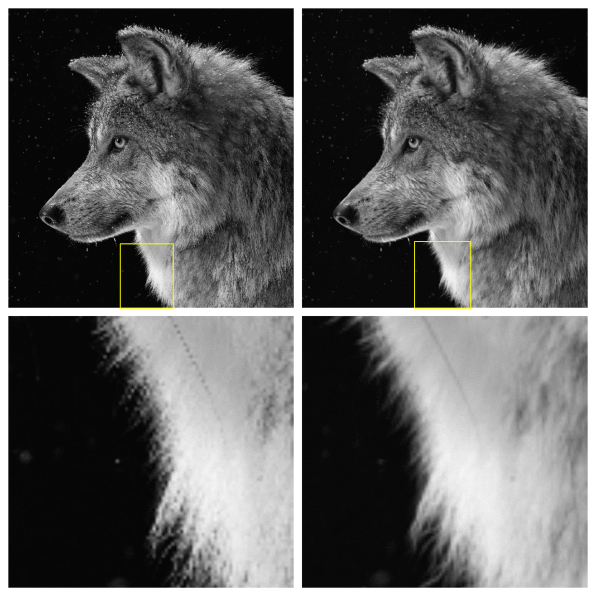

<p align="center">
  
</p>

[](https://mybinder.org/v2/gh/digantamisra98/Custom-Folded-Clausen-Based-Low-Pass-Filter/master)
[](https://zenodo.org/badge/latestdoi/192178248)
[](LICENSE)

# Custom Folded Clausen Based LowPass Filter

## Abstract

Filter Design is an important procedure of Image Processing to present new digital filters which can challenge the current state of the art filters with improved performance and results. This paper is a comprehensive, intuitive and novel approach of designing Custom Folded Clausen based low pass filters inspired from the architecture of a standard Gaussian Gabor Filter which can be applied on images for noise removal, smoothening or blurring the image, low-level abstract detection of spatial orientated edges and low-level segmentation; and can be modified to improve performance or modulate its use. 

## Filter Parameters:

|Filter Psuedo Name| Type of Clausen Function| Mean Value for Folded Normal Kernel (𝝁)| Standard Deviation Value for Folded Normal Kernel (𝝈)|
|---|---|---|---|
|Filter Y|1<sup>st</sup> Order Standard Clausen Function|0 |1| 
|Filter X| 2<sup>nd</sup> Order Glaisher SL-type Clausen Function|0 | 1|
|Filter XI|  2<sup>nd</sup> Order Glaisher SL-type Clausen Function|1 |1 |
|Filter XII| 2<sup>nd</sup> Order Glaisher SL-type Clausen Function|0.5 |1.5 |
|Filter XIII|  2<sup>nd</sup> Order Glaisher SL-type Clausen Function|0.5|2 |
|Filter XIV | 2<sup>nd</sup> Order Glaisher SL-type Clausen Function |2 |1 |
|Filter XV | 2<sup>nd</sup> Order Glaisher SL-type Clausen Function|0 | 0.5 |

## Results

Filter X applied on a standard test image:
<div style="text-align:center"></div>

Filter XII applied on the same standard test image:
<div style="text-align:center"></div>

<em> Image Credits: National Geographic and Scikit-Image
</em>

### Filtering Time Comparison:

|Filter Name| Runtime in seconds (Resolution - 512x512) | Runtime in seconds (Resolution - 2021x2021)|
|---|---|---|
|GABOR |0.7231871 |4.742698799999971 |
|FILTER Y |0.31141730000000223| 4.7652437000001555 | 
|FILTER X |0.721678| 4.695399900000211 |
|FILTER XI |0.31112860000001774| 4.724164799999926 |
|FILTER XII |0.3133619999999837| 4.69758690000026 |
|FILTER XIII |0.2977893999999992| 4.775738300000057 |
|FILTER XIV |0.3143409999998994| 4.790427799999861 |
|FILTER XV |0.31068419999996677| 4.756758600000012 |

## Code and Documentation: 

> Click on the Binder Badge to open a Jupyter Instance to run the IPython Notebook provided [here](https://github.com/digantamisra98/Custom-Folded-Clausen-Based-Low-Pass-Filter/blob/master/Clausen_Folded_Filter.ipynb). 


> To read the paper, click [here](https://github.com/digantamisra98/Custom-Folded-Clausen-Based-Low-Pass-Filter/blob/master/CS.pdf).

## Cite this work:

```
@misc{Clausen Folded Low-Pass Filters,
  author = {Diganta Misra},
  title = {Custom Folded Clausen based Low Pass Filters},
  year = {2019},
  url = {https://github.com/digantamisra98/Custom-Folded-Clausen-Based-Low-Pass-Filter},
}
```

## Reach Out: 
- [LinkedIn](https://www.linkedin.com/in/misradiganta/)<br>
- Email: mishradiganta91@gmail.com
